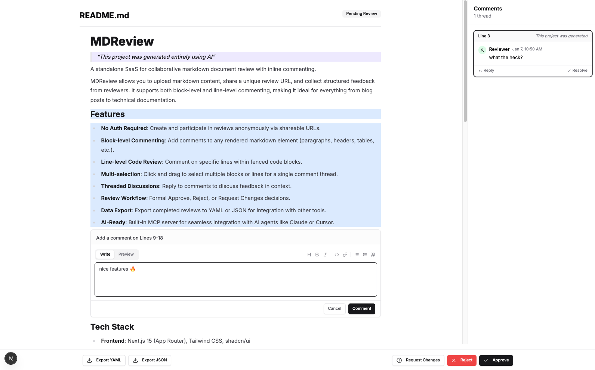

# MDReview

> This project was generated entirely using AI



A standalone SaaS for collaborative markdown document review with inline commenting.

MDReview allows you to upload markdown content, share a unique review URL, and collect structured feedback from reviewers. It supports both block-level and line-level commenting, making it ideal for everything from blog posts to technical documentation.

## Features

- **Google OAuth**: Sign in with Google to create owned, private reviews.
- **API Keys**: Generate API keys for agent access from the Settings page.
- **Anonymous Reviews**: Create reviews without signing in — shareable via URL.
- **Block-level Commenting**: Add comments to any rendered markdown element (paragraphs, headers, tables, etc.).
- **Line-level Code Review**: Comment on specific lines within fenced code blocks.
- **Multi-selection**: Click and drag to select multiple blocks or lines for a single comment thread.
- **Threaded Discussions**: Reply to comments to discuss feedback in context.
- **Data Export**: Export reviews to YAML or JSON for integration with other tools.
- **AI-Ready**: Built-in MCP server for seamless integration with AI agents like Claude or Cursor.

## Tech Stack

- **Frontend**: Next.js 15 (App Router), Tailwind CSS, shadcn/ui
- **Auth**: NextAuth v5 (Auth.js) with Google OAuth + Drizzle adapter
- **Database**: PostgreSQL with Drizzle ORM
- **Monorepo**: Turborepo + pnpm
- **Content**: React Markdown + Prism (for code highlighting)
- **MCP**: @modelcontextprotocol/sdk

## Project Structure

```
mdreview/
├── apps/
│   └── web/           # Next.js 15 application & API
├── packages/
│   ├── mcp/           # Model Context Protocol server
│   └── typescript-config/ # Shared TypeScript configurations
└── .openfleet/        # Project management & agent context
```

## Quick Start

### Prerequisites

- Node.js >= 20
- pnpm >= 9
- PostgreSQL database

### Installation

1. Clone the repository and install dependencies:

   ```bash
   pnpm install
   ```

2. Set up the environment variables:

   ```bash
   cp apps/web/.env.example apps/web/.env.local
   # Edit apps/web/.env.local and add your DATABASE_URL
   ```

3. Initialize the database:

   ```bash
   pnpm db:push
   ```

4. Start the development server:
   ```bash
   pnpm dev
   ```

The web app will be available at `http://localhost:3000`.

## MCP Integration

MDReview includes a Model Context Protocol (MCP) server, allowing AI agents to interact with the review process.

### Tools

- `request_review`: Create a new markdown review and get a shareable URL.
- `get_review_status`: Check the current status and comment count of a review.
- `add_comment`: Add a reply to an existing comment thread.
- `resolve_thread`: Mark a comment thread as resolved.

### Setup

1. Generate an API key from [markdown-review.vercel.app/settings/api-keys](https://markdown-review.vercel.app/settings/api-keys)

2. Add the MCP server to your client config:

**opencode** (`~/.config/opencode/opencode.json`):
```json
{
  "mcp": {
    "mdreview": {
      "type": "local",
      "command": ["npx", "-y", "@scottsus/mdreview-mcp@latest"],
      "environment": {
        "MDREVIEW_API_KEY": "mdr_your_key_here"
      }
    }
  }
}
```

**Claude Desktop** (`claude_desktop_config.json`):
```json
{
  "mcpServers": {
    "mdreview": {
      "command": "npx",
      "args": ["-y", "@scottsus/mdreview-mcp@latest"],
      "env": {
        "MDREVIEW_API_KEY": "mdr_your_key_here"
      }
    }
  }
}
```

> **Note:** Without `MDREVIEW_API_KEY`, reviews are created anonymously and are publicly accessible to anyone with the URL.

## License

MIT
